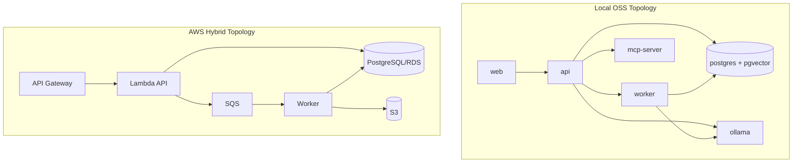
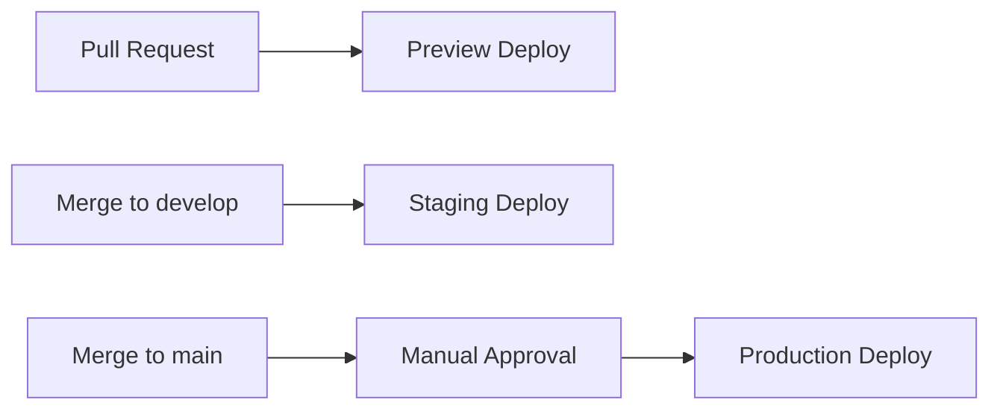

# ai-devtool-infra

Infrastructure as code, deployment workflows, and local stack configuration for AI DevTool.

## What This Repo Owns
- Environment topology definitions for preview, staging, and production.
- Deployment workflow templates.
- Local developer stack composition.

## Bounded Context
- Owns provisioning and release infrastructure.
- Does not own runtime service logic.

## System Design Diagram

## Deployment Workflow

## Repository Layout
- terraform/environments: environment-specific IaC roots
- aws: cloud deployment assets
- docker: local stack configuration
- scripts: operational scripts
- .github/workflows: deployment automation

## Operating Standards
- Environment-scoped secrets and protections.
- Concurrency lock per deployment environment.
- Post-deploy smoke checks required.
- Rollback runbook maintained for each environment.

## Local Development
1. Review environment folder under terraform/environments
2. Validate IaC format and plan
3. Run local stack from docker assets

## Definition of Done for Infra Changes
- Plan/apply checks reviewed.
- Rollback path documented.
- Environment parity impact assessed.
